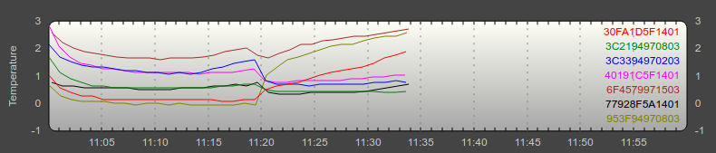
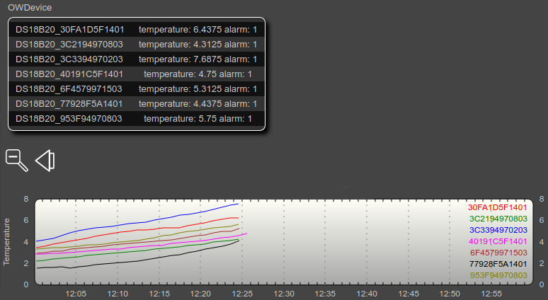

# RPI-w1-examples
A guide to using 1-wire sensors on the raspberry pi and other embedded linux platforms.

# Abstract
This project teaches the install of 1-wire devices on a raspberry pi without any additional 1-wire master.
A set of examples is designed to illustrate the usage of 1-wire with DS18B20 sensors, from the basics to a full fledged 1-wire server application.

Contents:
- Setting up the device tree overlay for 1-wire
- Reading a 1-wire device from the regular file system
- Writing a python script to access sensors from the regular file system
- Installing owfs, the One Wire File System
- Accessing owserver from the command line and via web browser
- Writing a python script to access sensors via owserver
- Some additional info on the popular DS18B20 waterproof version
- Making this useful in home automation - FHEM in particular

# Setting up the device tree overlay for 1-wire
There are two ways.
1. via raspi-config
´´´
sudo raspi-config
>> interfacing options >> 1-wire >> yes
´´´
2. via config.txt
´´´
sudo nano /boot/config.txt
´´´
add the line
´´´
dtoverlay=w1-gpio
´´´
and save. This is actually what raspi-config does.
A system reboot is necessary to activate the device tree overlay and w1 kernel module respectively.

# Reading a 1-wire device from the regular file system
This is the first expierence with 1-wire and a good look how a device is represented in the file system.

´´´
ls /sys/bus/w1/devices/
´´´
Will show you a list of cryptic entries. The names that don't make sense are the devices.
DS18B20 devices start with "28." followed by a hexadecimal number.
A further look into the device's directory shows a file named w1-slave
(/sys/bus/w1/devices/28.40191C5F1401/w1-slave). We read that file to console output with cat.
´´´
cat /sys/bus/w1/devices/28.40191C5F1401/w1-slave
´´´
And look at the magic. Two lines of output will show, a left part of hexdecimal numbers and a right part of text. First line will end with CRC=OK and the second line will end with a t=XXXXX a decimal number showing the temperature in milli degree celsius.
When reading w1-slave, a transfer is started on the 1-wire bus and the data retrieved is shown on output with annotations such as CRC and temperature. This is true to the saying, "On linux, everything is a file".

# Writing a python script to access sensors from the regular file system

Open the scipt test_w1_sensor_temp.py in an editor, preferebly with some syntax highlighting.

This script actually does the things that we did manually before.
- Look through the devices that have a w1_slave entry.
- Read the device file, grap the temperature and scale it to degree celsius
- Print the value dictionary that we filled itering over the devices.

Execute the script and check the output.
´´´
$ python3 test_w1_sensor_temp.py
{'28-01145a8f9277': 0.375,
 '28-01145f1c1940': 0.812,
 '28-01145f1dfa30': 0.937,
 '28-03029794333c': 0.625,
 '28-03089794213c': 0.437,
 '28-030897943f95': 1.875,
 '28-03159779456f': 2.187}
´´´

Unfortunately this is the point were most tutorials stop, before telling you the crucial parts to make it useful. We will continue through.

# Installing owfs, the One Wire File System
We install 2 packages for owfs, the server and the shell tools.
´´´
sudo apt-get install owserver ow-shell
´´´
owserver install may report an error for not being configured. Therefore we edit the configuration file.
´´´
sudo nano /etc/owfs.conf
´´´
comment all lines, add these lines below and save.
´´´
server: w1
! server: server = localhost:4304
http: port = 2121
´´´
This makes the owfs use the w1 kernel driver, setup the server on localhost and setup a http access for the web browser.
Instead of the "localhost", you can write the hostname "rpi-0w-1" in my case.
This does make the server available from another machine.
´´´
server: w1
! server: server = rpi-0w-1:4304
http: port = 2121
´´´

A reboot may be required to make everything work as expected.
One word about owfs documenation, it focuses on adapters, w1-master chips via usb or serial. Additionally owfs moved from source-forge to github in mid 2018 and documentation is scattered around both locations.
The documentation that got me started with a working configuration was part of an issue reporting thread on github. Currently owfs is at version 3.2p3. If the above configuration does not work for you, look on github, not on source-forge.

# Accessing owserver from the command line and via web browser

Time for testing. On the raspberry pi try

´´´
owdir /uncached
´´´
This should show something similar to the contents of /sys/bus/w1/devices/ but we just got there via owserver. And we can read the temperature directly now.

´´´
owread -s /uncached/28.40191C5F1401/temperature
´´´
This will print the temperature in degree celsius.
We can do that from any other machine that has ow-shell package installed

´´´
owread -s rpi-0w-1.local:4304 28.40191C5F1401/temperature
´´´

If we just want a look on the values, we can access it via web browser on port 2121, in my case
http://rpi-0w-1.local:2121 .

# Writing a python script to access sensors via owserver
Open the script test_owfs.py in an editor. Again it does as we did manually.
- It calls owdir to find the sensors but we filter the sensors by the pattern "28.*" as we only want the DS18B20 sensors.
- Then it calls owread on each sensor, retrieving the temperature values.
- It does some additional evaluation as I'm having problems with sensor calibration of the so called waterproof version.

Execute the script.
´´´
$ python3 test_owfs.py 
28.40191C5F1401 0.8125
28.30FA1D5F1401 0.75
28.3C2194970803 0.4375
28.3C3394970203 0.6875
28.953F94970803 1.625
28.77928F5A1401 0.3125
28.6F4579971503 1.9375
Statistics:
7 Sensors
min:0.3125
mean: 0.9375
max:1.9375
stdev:0.6091746465505602
´´´
The funny thing is, this works on both the raspberry pi and every host system that has the ow-shell package installed.

# Some additional info on the popular DS18B20 waterproof version
It is not waterproof, it is heatshrinked in a steel tube and should not be submerged in water below the heatshrink.
The quality usually is anti-proportional to the price you paid. There seem to be originals and chinese copies.
There are reports that the cheap ones are failed production parts, may be shorted inside the steel tube or the steel tube may be shorted to VCC, so check every sensor first, regardless of origin.
I bought 7 pieces adafruit 381 for about 5.5 euros each which is in the medium price range.
No sensors had shorts but the accuracy is questionable.
One sensor showed 2 degrees above all others while in the same cup of hot water.
Changing the power supply from 3.3V to 5V while leaving the pullup resistor on 3.3V has increased the accuracy but it is still around 1 degC between min and max.

# Making this useful in home automation - FHEM in particular

If you have a working FHEM server, you can add the 1-wire sensors via owserver with the following steps.

Get the right version of the perl module from github. It is located at

´´´
https://github.com/owfs/owfs/blob/master/module/ownet/perl5/OWNet/lib/OWNet.pm
´´´

Copy that file to the FHEM library directory, with the correct version name.

´´´
/opt/fhem/FHEM/lib/OWNet-3.2p3.pm
´´´
I copied the raw file contents directly into a new file with that path.

In FHEM command window define the OWServer with reference to the real ip. Hostnames did not work for unknown reason.

´´´
define myRemoteOWServer OWServer 192.168.2.67:4304 3.2p3
´´´

Now you may wait for a minute as FHEM hangs until all data is fetched for the first time, but after that 
you find a new room entry in FHEM called OWDevices and almost everything is autocreated there.
Now you can actually use your 1-Wire server.
Other home automation servers may work in a similar way.

define FileLog_DS18B20 FileLog /opt/fhem/log/filelog_ds18b20_%Y_%m_%d.log DS18B20_.*:temperature.*

After running some tests with 7 sensors in a cup of ice water and hot water, it shows that some sensors drift away from the others or maybe the contact with the cups surface has an effect on the reading.

